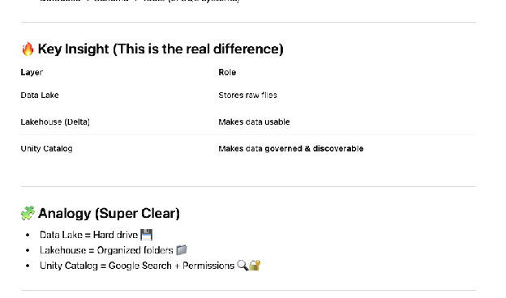
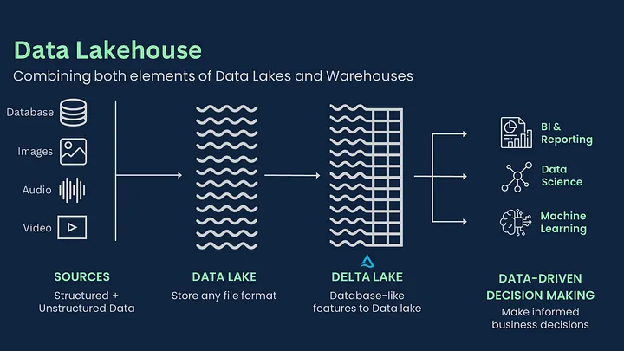
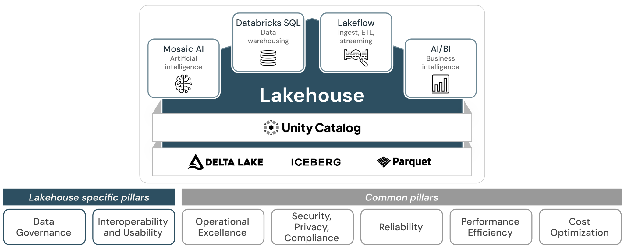
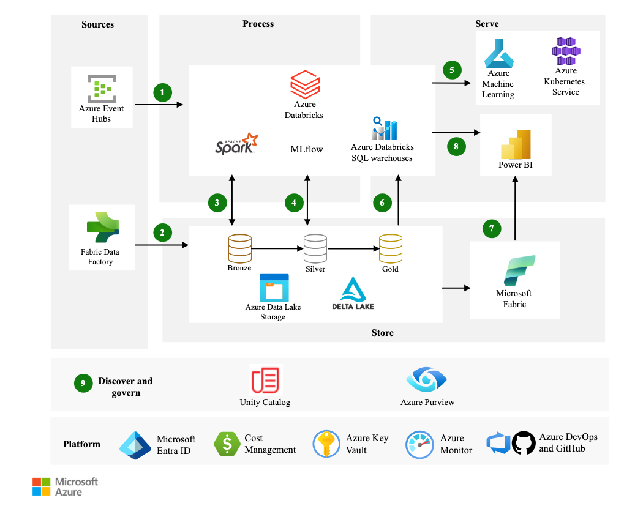
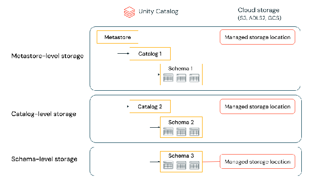

# **1\. Origin: Built by Spark Creators**

Databricks was founded by the creators of Apache Spark at UC Berkeley AMPLab.

### **Why they built it:**

* Spark was powerful but **hard to deploy and manage**  
* Enterprises needed:  
  * Easy cluster management  
  * Collaboration tools (notebooks)  
  * Scalable data pipelines

👉 So they created **Databricks** to commercialize Spark in a usable way.

---

# **⚙️ 2\. Core Architecture (How it’s built)**

## **A. Distributed Compute Layer**

* Based on **Apache Spark**  
* Runs on clusters of machines (VMs in cloud)  
* Handles:  
  * Batch processing  
  * Streaming  
  * Machine learning workloads

👉 Internally:

* Driver node (controls execution)  
* Worker nodes (execute tasks in parallel)

---

## **B. Cloud-Native Infrastructure**

Databricks is not on-prem-first—it’s built for cloud:

* Runs on:  
  * Amazon Web Services  
  * Microsoft Azure  
  * Google Cloud

### **Key idea:**

* Uses cloud APIs to dynamically:  
  * Spin up clusters  
  * Scale compute  
  * Store data

---

## **C. Storage Layer (Lakehouse Concept)**

Databricks pioneered the **Lakehouse architecture**.

### **Built on:**

* Data lakes (cheap storage like S3, ADLS)  
* Structured layers using **Delta Lake**

### **Delta Lake adds:**

* ACID transactions  
* Schema enforcement  
* Time travel (versioned data)

👉 This is what makes it production-grade.

---

## **D. Workspace & Collaboration Layer**

* Web-based notebooks (similar to Jupyter but enterprise-grade)  
* Multi-language support:  
  * Python  
  * SQL  
  * Scala  
  * R

Features:

* Real-time collaboration  
* Version control integration  
* Job scheduling

## **🧩 3\. Key Components Inside Databricks**

### **1\. Cluster Manager**

* Automatically creates Spark clusters  
* Handles autoscaling  
* Optimizes resource usage

---

### **2\. Job Scheduler**

* Runs ETL pipelines  
* Supports:  
  * Batch jobs  
  * Streaming pipelines

---

### **3\. ML & AI Layer**

* Built-in ML tools:  
  * MLflow  
* Model tracking, deployment, experiment logging

---

### **4\. SQL Engine**

* Databricks SQL (data warehousing layer)  
* Optimized query engine on top of Spark

# **4\. Engineering Stack (What it's built with)**

### **Backend:**

* Scala (core Spark engine)  
* Java  
* Python (APIs, integrations)

### **Frontend:**

* React / modern web stack  
* Notebook UI

### **Infrastructure:**

* Kubernetes (in newer deployments)  
* Cloud-native APIs  
* REST APIs for automation

---

# **🔄 5\. How It Evolved**

### **Phase 1:**

* Spark as open-source engine

### **Phase 2:**

* Managed Spark platform (Databricks)

### **Phase 3:**

* Introduction of Lakehouse \+ Delta Lake

### **Phase 4 (Current):**

* Unified platform:  
  * Data Engineering  
  * Analytics  
  * AI/LLMs (Databricks Mosaic AI)

---

# **🚀 6\. What Makes Databricks Special**

Compared to traditional systems:

| Traditional | Databricks |
| ----- | ----- |
| Separate tools (ETL, BI, ML) | Unified platform |
| Manual cluster setup | Auto-managed |
| Data warehouse only | Lakehouse (flexible \+ scalable) |
| Limited scalability | Massive distributed compute |

  

  

